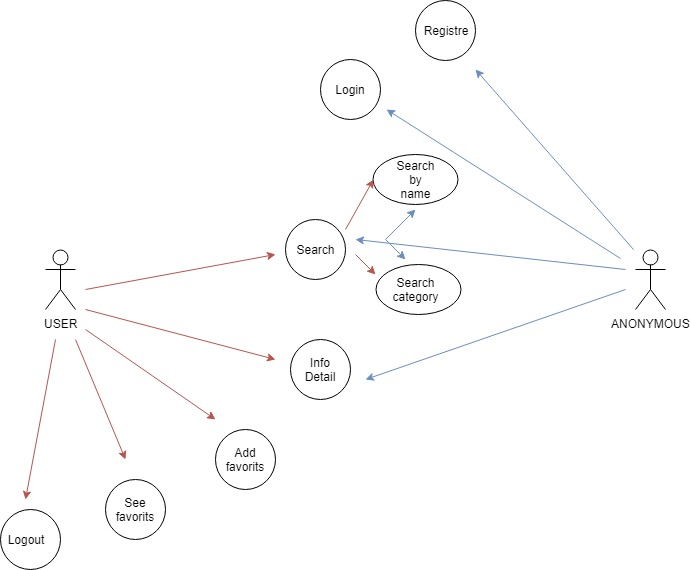
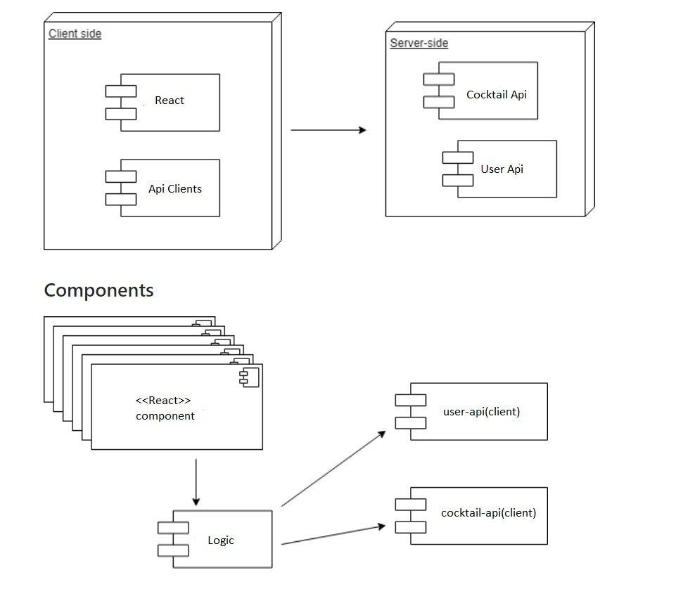
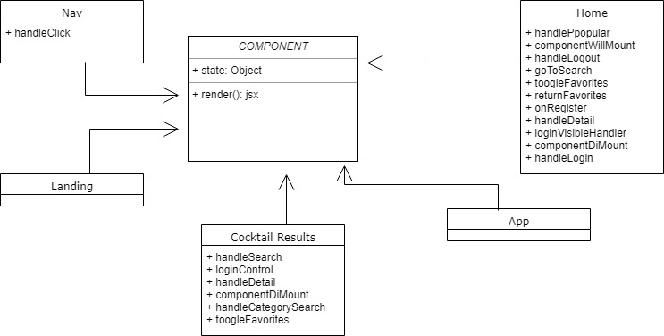
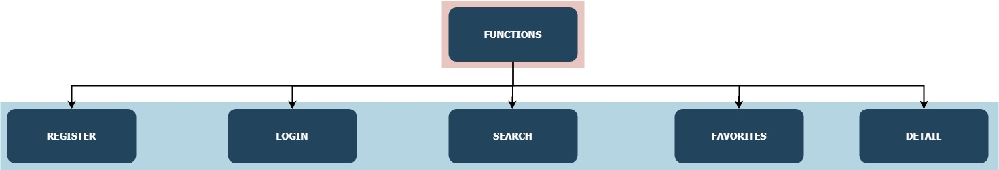
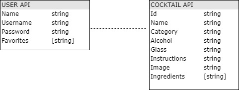

# DRUNK N DROP

 
 
 

## Introduction

Discover cocktails you can make from the alcohol you already have, from simple cocktails To more complex recipes of wonderfull drinks. Use our Cocktail Searcher to find more than 500 recipes and add it to your personal account (You can Register and Login) and store yor favorites. 

<!-- ## [Live Demo](http://drunk-n-drop.surge.sh/#/) -->

### Use Cases

### Components && Blocks

## Class /Objects

##Functions

### Data Model

